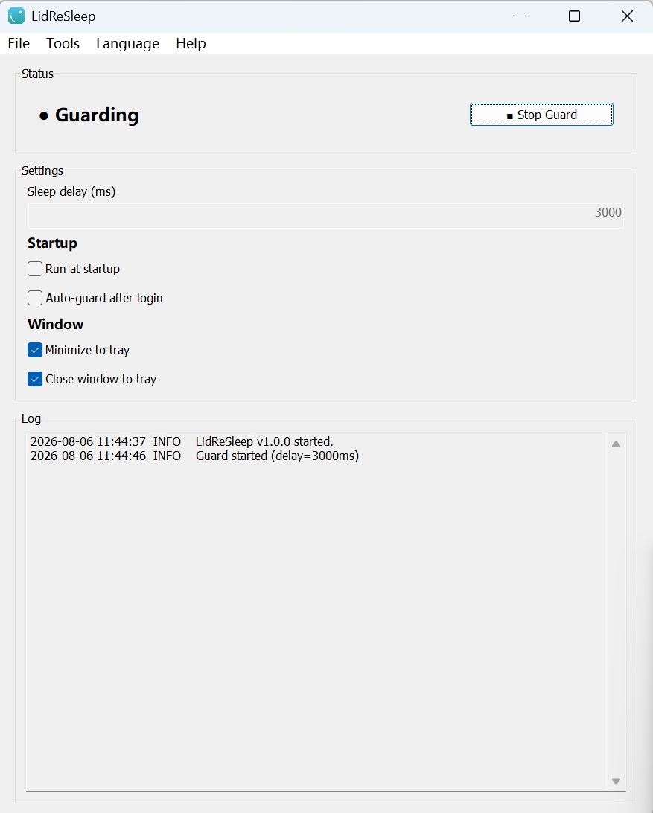

# LidReSleep

[English](./README.md) | [简体中文](./README.zh-CN.md) | [日本語](./README.ja.md) | [한국어](./README.ko.md) | [Français](./README.fr.md) | [Deutsch](./README.de.md) | [Español](./README.es.md) | [Русский](./README.ru.md) | [Português](./README.pt.md) | **Italiano**

Un piccolo strumento per Windows in background che impedisce al portatile di surriscaldarsi durante la notte dopo aver chiuso lo schermo.

Molti portatili moderni (Modern Standby) non dormono davvero quando lo schermo è chiuso: lo schermo si spegne ma il sistema resta connesso a basso consumo, e può essere facilmente **riattivato e mantenuto attivo** da richieste di rete, attività in background, ecc., causando calore e consumo di batteria per tutta la notte.

Quello che fa LidReSleep è semplice: **sospensione alla chiusura dello schermo; se viene riattivato inaspettatamente mentre lo schermo è ancora chiuso, si riaddormenta automaticamente finché non apri lo schermo.**

- Applicazione portatile in un unico file, nessuna installazione
- 10 lingue dell'interfaccia (简体中文 / English / 日本語 / 한국어 / Français / Deutsch / Español / Русский / Português / Italiano), rilevate automaticamente dalla lingua di sistema
- Windows 10/11 (x64 / ARM64 / x86), scegli la versione per la tua CPU



## Avvio rapido

1. Scarica la versione per la tua CPU e fai doppio clic (es. `LidReSleep-amd64.exe`) per aprire il pannello.
2. Fai clic su **「▶ Avvia protezione」**; lo stato passa a `● Protezione attiva`.
3. Chiudi lo schermo e via.

Dopo: chiudi lo schermo → sospensione immediata; riattivato con lo schermo ancora chiuso → nuova sospensione dopo ~3 secondi (predefinito); apri lo schermo → annulla e riprendi normalmente.

## Guida all'interfaccia

### Stato
- `● Arrestato / ● Protezione attiva`, indica se la protezione è in esecuzione.
- Pulsante `▶ Avvia protezione / ■ Arresta protezione`, il testo cambia con lo stato.

### Impostazioni

| Impostazione | Descrizione | Predefinito |
|---|---|---|
| Ritardo sospensione (ms) | attendere questo tempo prima di riaddormentarsi dopo la riattivazione | `3000` |
| ☑ Esegui all'avvio | avvio automatico al login di Windows (livello di sistema, registro) | No |
| ☑ Protezione automatica dopo l'accesso | avvia la protezione e riduci a icona nella barra delle applicazioni all'avvio | No |
| ☑ Riduci a icona nella barra delle applicazioni | nascondi nella barra delle applicazioni durante la riduzione a icona | Sì |
| ☑ Chiudi nella barra delle applicazioni | nascondi nella barra delle applicazioni invece di uscire alla chiusura | Sì |

- Le modifiche vengono **salvate automaticamente**, nessun salvataggio manuale necessario.
- Esegui all'avvio si applica subito (registro); le altre impostazioni sono memorizzate in `config.json` accanto all'exe.

### Menu
- **File**: Esci
- **Strumenti**: Prova sospensione (sospendi una volta per verificare)
- **Lingua**: 10 lingue (la spunta indica quella attuale; si applica immediatamente)
- **Aiuto**: Verifica aggiornamenti (controlla GitHub per una nuova versione), Pagina del progetto, Informazioni (funzioni e spiegazione di Modern Standby)

### Registro
Ogni riga ha un timestamp e un livello, mostra in tempo reale gli eventi di schermo/riattivazione/ri-sospensione, con scorrimento automatico e limite di 200 KB.

| Livello | Significato |
|---|---|
| `INFO` | informazioni generali |
| `EVENT` | eventi di sistema (schermo/sospensione/riattivazione) |
| `ACTION` | azioni del programma (pianificazione/annullamento/sospensione) |
| `ERROR` | errore (con motivo) |

### Barra delle applicazioni (sistema)
- Nascondi nella barra delle applicazioni alla minimizzazione/chiusura (se abilitato).
- Clic sinistro sull'icona: ripristina la finestra principale; clic destro: Mostra finestra principale / Esci.

## Domande frequenti

**Perché il mio portatile continua a scaldarsi dopo aver chiuso lo schermo?**
Probabilmente è Modern Standby a riattivarlo. Usa Strumenti → Prova sospensione per verificare; dopo aver chiuso lo schermo con la protezione attiva, controlla nel registro `ACTION Esecuzione sospensione`.

**Cos'è Modern Standby?**
Vedi la spiegazione in linguaggio semplice in Aiuto → Informazioni.

**Come esco completamente?**
Clic destro sull'icona nella barra delle applicazioni → Esci (se "Chiudi nella barra delle applicazioni" è abilitato, ✕ riduce solo a icona).

**Esegui all'avvio non funziona?**
Dipende dall'account utente corrente; gli errori (es. esecuzione da una posizione limitata) vengono registrati con il motivo.

## Utenti avanzati: ridurre le riattivazioni (opzionale)

Lo strumento gestisce la "ri-sospensione dopo la riattivazione". Per ridurre le riattivazioni stesse, esegui in un PowerShell con privilegi elevati:

```powershell
# disattivare i timer di riattivazione
powercfg /setacvalueindex SCHEME_CURRENT SUB_SLEEP 0 0
powercfg /setdcvalueindex SCHEME_CURRENT SUB_SLEEP 0 0
# ispezionare le origini di riattivazione
powercfg /waketimers
powercfg /devicequery wake_armed
# ripristinare le impostazioni predefinite
powercfg /restoredefaultschemes
```

---

## Download

Ottieni l'ultima versione da GitHub Releases: [LidReSleep Releases](https://github.com/dootn/LidReSleep/releases/latest)

| File | CPU | Download |
|---|---|---|
| `LidReSleep-amd64.exe` | Intel/AMD 64 bit (la maggior parte dei PC) | [amd64](https://github.com/dootn/LidReSleep/releases/latest/download/LidReSleep-amd64.exe) |
| `LidReSleep-arm64.exe` | ARM64 (es. Surface Pro X, PC Snapdragon) | [arm64](https://github.com/dootn/LidReSleep/releases/latest/download/LidReSleep-arm64.exe) |
| `LidReSleep-386.exe` | x86 a 32 bit | [386](https://github.com/dootn/LidReSleep/releases/latest/download/LidReSleep-386.exe) |

> Pagina del progetto: https://github.com/dootn/LidReSleep
